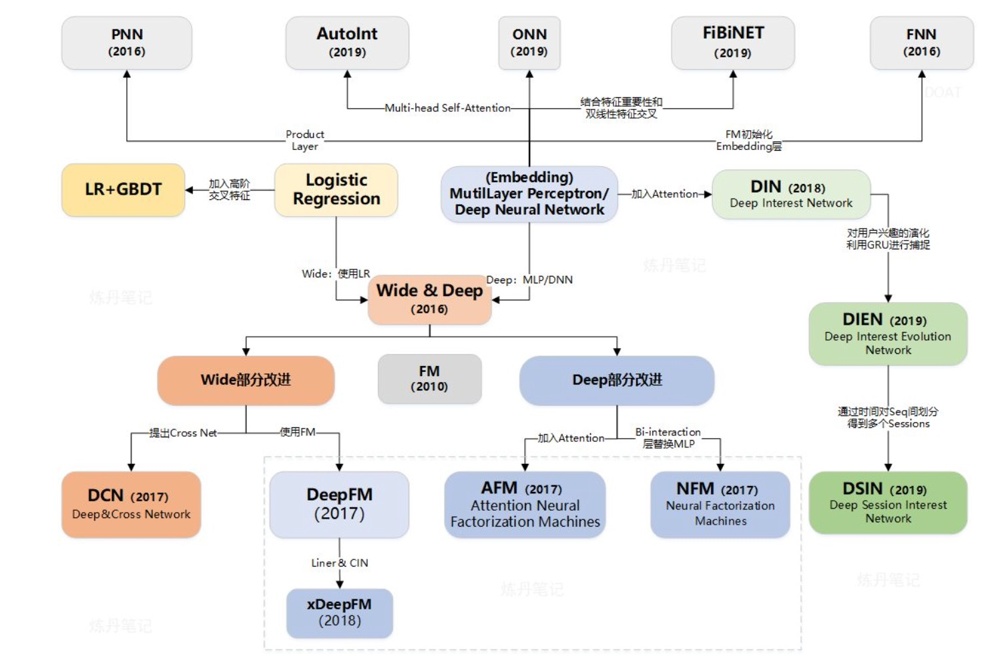
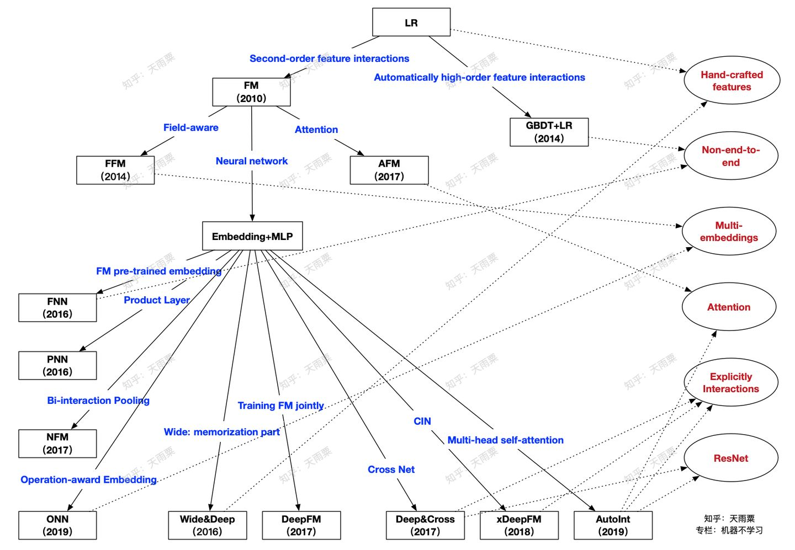

[TOC]

# ​CTR点击率预估系列家谱

# BLOG

[CTR 预估模型家族关系1](https://zhuanlan.zhihu.com/p/243243145)

[CTR 预估模型家族关系2](https://zhuanlan.zhihu.com/p/104307718)

[transformers在ctr中的应用](https://zhuanlan.zhihu.com/p/349509932)

# Paper

[R-RNN: Extracting User Recent Behavior Sequence for Click-Through Rate Prediction](https://ieeexplore.ieee.org/stamp/stamp.jsp?arnumber=8758622)

==========

https://blog.csdn.net/Sinsa110/article/details/52202220 (XGBoost模型文件转化为PMML)
https://zhuanlan.zhihu.com/p/23382412 (机器学习算法线上部署方法)

# code example
https://tianchi.aliyun.com/forum/new_articleDetail.html?postsId=4539 (pnn)

https://www.jianshu.com/p/88e3fba82e39

https://www.jianshu.com/p/5b73444eb47d

https://www.infoq.cn/article/V0wtItKL7BAIyJ-WKoz8

https://www.jiqizhixin.com/articles/Alibaba-deeplearning-framework-XDL-release

https://www.cnblogs.com/Lee-yl/p/11252334.html

https://www.qianzhan.com/analyst/detail/220/191115-7279feef.html

https://t.qianzhan.com/daka/detail/180806-6f100876.html#comment

https://www.qianzhan.com/analyst/detail/220/191113-d35584e4.html

