[TOC]

# FM(Factorization Machine) 模型

## 基本介绍

FM模型是一种基于矩阵分解的机器学习模型，对于稀疏数据具有很好的学习能力，解决了LR泛化能力弱的问题。

- FM 主要目标
  
  > 解决数据稀疏的情况下，特征怎样组合的问题

- FM优点
  
  > 1. 可以在非常稀疏的数据中进行合理的参数估计
  > 2. FM模型的时间复杂度是线性的
  > 3. FM是一个通用的模型，它可以用于任何特征为实值的情况

## FM算法原理

### one-hot导致稀疏性

### FM交叉项求解

在一般线性模型中，各个特征是独立考虑的，没有考虑特征与特征之间的相互关系。即一般的线性模型表达式为

$y = w_0 + \sum_{i=1}^n w_ix_i$

但实际中，大量的特征之间是有关联的，为了表述特征之间的相关性，我们采用多项式模型。在多项式模型中，特征 $x_i$ 与 $x_j$ 的组合用 $x_ix_j$表示。简单起见，我们只讨论二阶多项式

$y = w_0 + \sum_{i=1}^n w_i x_i + \sum_{i=1}^{n-1} \sum_{j=i+1}^n w_{ij} x_i x_j$

该多项式模型与线性模型相比，多了特征组合的部分，特征组合部分的参数有 $C_n^2 = \frac{n(n-1)}{2}$ 复杂度为 $n^2$。如果特征非常稀疏且维度很高的话，时间复杂度大大增加。

为了求出 $w_{ij}$，我们对每一个特征分量$x_i$ 引入辅助向量 $v_i = (v_{i1}, v_{i2}, ..., v_{ik})$ ，然后利用 $v_i v_j^T 对w_{ij}$ 进行求解

 时间复杂度将为 O(kn) 

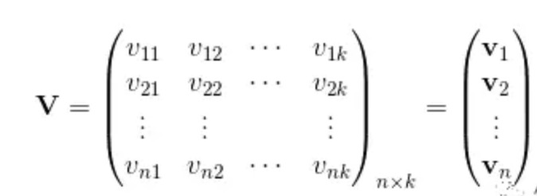

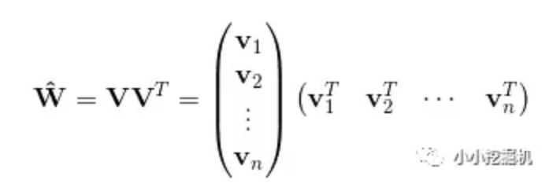

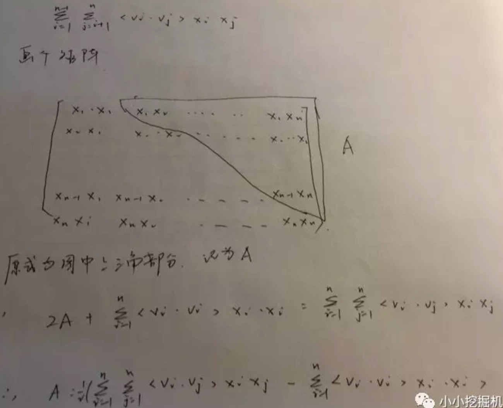

具体过程如下

$\sum_{i=1}^{n-1} \sum _{j=i+1}^n <v_i, v_j> x_i x_j$

$= 1/2 (\sum_{i=1}^{n} \sum_{j=1}^n <v_i, v_j> x_i x_j - \sum_{i=1}^n <v_i, v_j> x_i x_i )$

$= 1/2 (\sum_{i=1}^n \sum_{j=1}^n \sum_{f=1}^k v_{i,f} v_{j,f} x_i x_j - \sum_{i=1}^n \sum_{f=1}^i v_{i,f} v_{i,f} x_i x_i )$

$= 1/2 \sum_{f=1}^k ((\sum_{i=1}^n v_{i,f} x_i) (\sum_{j=1}^n v_{j,f} x_j) - \sum_{i=1} v_{i,f}^2 x_i^2 )$

$= 1/2 \sum_{f=1}^k ( (\sum_{i=1}^n v_{i,f} x_i)^2 - \sum_{i=1} v_{i,f}^2 x_i^2 )$

### 基于随机梯度优化

- 损失函数和成本函数推导

[LR 损失函数推导](https://github.com/anty-zhang/recommend/blob/master/loss_function/loss_function.md)

$$\begin{array}{l}
L(y,\widehat y) = \sum\limits_{i = 1}^m { - \log \sigma ({y^{(i)}}{{\widehat y}^{(i)}})} \\
\frac{{\partial L(y,\widehat y)}}{{\partial \theta }} =  - \frac{1}{{\sigma (y\widehat y)}}\sigma (y\widehat y)(1 - \sigma (y\widehat y))y\frac{{\partial \widehat y}}{{\partial \theta }}\\
 = (\sigma (y\widehat y) - 1)y\frac{{\partial \widehat y}}{{\partial \theta }}
\end{array}$$

$$\begin{array}{l}
\widehat y = {w_0} + \sum\limits_{i = 1}^n {{w_i}{x_i} + } \sum\limits_{i = 1}^{n - 1} {\sum\limits_{j = i + 1}^n {{w_{ij}}{x_i}{x_j}} } \\
 = {w_0} + \sum\limits_{i = 1}^n {{w_i}{x_i} + } 1/2\sum\limits_{f = 1}^k {((} \sum\limits_{i = 1}^n {{v_{i,f}}} {x_i}{)^2} - \sum\limits_{i = 1} {v_{i,f}^2} x_i^2)\\
L(y,\widehat y) = \sum\limits_{i = 1}^m { - \log \sigma ({y^{(i)}}{{\widehat y}^{(i)}})} \\
\frac{{\partial L(y,\widehat y)}}{{\partial \theta }} =  - \frac{1}{{\sigma (y\widehat y)}}\sigma (y\widehat y)(1 - \sigma (y\widehat y))y\frac{{\partial \widehat y}}{{\partial \theta }}\\
 = (\sigma (y\widehat y) - 1)y\frac{{\partial \widehat y}}{{\partial \theta }}
\end{array}$$

$$\begin{array}{l}
\frac{{\partial \widehat y}}{{\partial \theta }} = \left\{\begin{matrix} \\
1 & if \quad \theta  = {w_0}\\
{x_i} & if \quad \theta  = {w_i}\\
{x_i}\sum\limits_{j = 1}^n {{v_{j,f}}{x_j} - {v_{i,f}} x_i^2}  & if \quad \theta  = {v_{i,f}} \\
\end{matrix} \right.
\end{array}$$

- 参数更新逻辑

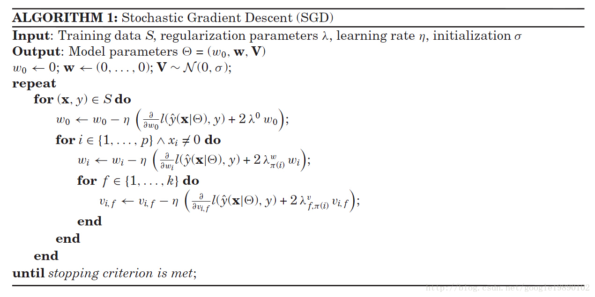

- 代码实现

## FM和其它算法比较

- FM VS MF
1. FM 可以更方便的加入特征，而MF 加入特征非常复杂
2. 在实际大规模数据场景下，在排序阶段，绝大多数只使用ID信息的模型是不实用的，没有引入Side Information(即除了User ID/Item ID 外很多其他有用的特征)，是不具备实战价值的。原因很简单，大多数真实应用场景中，User/Item有很多信息可用，而协同数据只是其中的一种，引入更多特征明显对于更精准地进行个性化推荐是非常有帮助的。而如果模型不支持更多特征的便捷引入，明显受限严重，很难真正实用，这也是为何矩阵分解类的方法很少看到在Ranking阶段使用，通常是作为一路召回形式存在的原因。

## reference

[FM 论文](https://www.csie.ntu.edu.tw/~b97053/paper/Rendle2010FM.pdf)

[libFM 优化算法论文](https://www.csie.ntu.edu.tw/~b97053/paper/Factorization%20Machines%20with%20libFM.pdf)

[FM(Factorization Machine)算法（推导与实现）(numpy)](https://blog.csdn.net/qq_24819773/article/details/86308868)

[FM TensorFlow实现](https://github.com/Johnson0722/CTR_Prediction/tree/master)

[tf fm 代码](https://github.com/babakx/fm_tensorflow/blob/master/fm_tensorflow.ipynb)

[CTR预估算法之FM, FFM, DeepFM及实践](https://blog.csdn.net/John_xyz/article/details/78933253)

[tensorflow实战练习，包括强化学习、推荐系统、nlp等](https://github.com/princewen/tensorflow_practice/tree/master)

[推荐系统遇上深度学习(一)--FM模型理论和实践](https://www.jianshu.com/p/152ae633fb00)

[FM算法及FFM算法((1, -1) logistic loss解释)](https://www.cnblogs.com/ljygoodgoodstudydaydayup/p/6340129.html)

[推荐系统召回四模型之：全能的FM模型](https://zhuanlan.zhihu.com/p/58160982)

# DeepFM

在基于CTR预估的推荐系统中，最重要的是学习到用户 点击行为背后隐藏的特征组合。 在不同的推荐场景中低阶特征组合或者高阶特征组合 可能都会对最终的CTR产生影响。

## DeepFM提出的原因

### 人工特征工程存在的两个问题

1. 特征爆炸。通常使用的Poly-2模型为例，该模型采用直接对2阶特征组合建模来学习权重，这种方式构造的特征数据量跟特征个数乘积相关。
2. 大量重要的特征组合隐藏在数据中，无法被专家识别或者设计。

### 广度模型

针对人工特征工程存在的两个问题，广度模型和深度模型都提出了不同的解决思路。其中广度模型包括FM/FFM等大规模低秩(Low-Rank)模型, FM/FFM 通过对特征的低秩展开，为每个特征构造隐士向量，并通过隐士向量的点乘结果来建模两个特征的组合关系，从而实现对二阶特组合的自动学习。

FM/FFM相对于Poly-2优势有如下两点：

1. FM/FFM模型所需要的参数个数远小于Poly-2模型，所需要的参数个数为 O(nm)，其中k 为隐式向量维度，n为特征个数；Poly-2模型为每个二阶特征组合需要的参数个数为O(m^2)。poly-2在特征进行one-hot之后，样本会变得稀疏。
2. 相比于Poly-2，FM/FFM能够更有效的学习参数（泛化能力强）。当一个2阶特征组合没有出现在训练集时，Poly-2模型则无法学习该特征组合的权重；但FM/FFM却依然可以学习，因为该特征组合的权重是由这2个特征的隐式向量点乘得到的，而这两个特征的隐式向量可以由别的特征组合学习到。例如：即使在训练数据中两个特征组合并为见过，意味着 $x_i， x_j$ 一起出现的次数为0，如果换做SVM、LR模式是无法学会着特特征组合的权重的。而对于FM学习的是单个特征的embedding，并不依赖某个特定的特征组合是否出现过，所以只要特征 $x_i$和其他任意特征组合出现过，那么就可以学习到自己对应的embedding向量。因此可以通过内积计算出这个新特征组合的权重，这也可是说是FM模型泛化能力强的根本原因。

总之，FM/FFM是一种有效地对二阶特征组合进行自动学习的模型

### 深度模型

通过神经网络结构和非线性激活函数，自动学习特征之间复杂的组合关系。目前在APP推荐领域中比较流行的深度模型有FNN/PNN/Wide and Deep。

FNN模型：用FM模型来对Embedding层进行初始化的全连接神经网络。

PNN模型：在Embedding层和全连接层之间引入内积/外积 层，来学习特征之间的交互关系

Wide and Deep模型：将LR和DNN联合训练

### DeepFM模型优势

广度模型(LR/FM/FFM)的局限：一般只能学习1阶，2阶特征组合

深度模型(FNN/PNN)的局限：一般学习的是高阶特征组合

Wide and Depp局限：依然需要人工特征工程来为Wide模型选取输入特征

DeepFM模型：结合了广度和深度模型的优点，联合训练FM和DNN模型，同时学习低阶和高阶特征组合。

无论是低阶特征组合还是高阶特征组合，对推荐效果都是非常重要的 ，其中总结DeepFM优点有如下两点：

1. DeepFM模型同时对低阶特征组合和高阶特征组合建模，从而能够学习到各阶特征之间的组合关系
2. DeepFM模型是一个端到端的模型，不需要任何的人工特征工程

此外，DeepFM模型的Deep component和FM component从Embedding层共享数据输入，这样做的好处是Embedding层的隐式向量在(残差反向传播)训练时可以同时接受到Deep component和FM component的信息，从而使Embedding层的信息表达更加准确而最终提升推荐效果

## DeepFM 算法原理

DeepFM系统框图

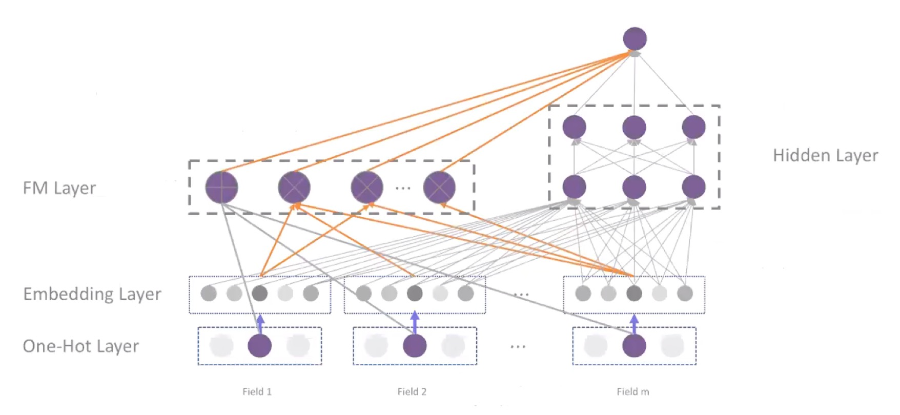

DeepFM包含两部分，左边的FM部分和右边的DNN部分。这两部分共享相同的输入。对于给定的特征i, $w_i$用于表示一阶特征的重要性，特征i的隐向量(latent vector) $V_i$ 用户表示和其他特征的相互影响。在FM部分，$V_i$ 用于表征二阶特征，同时在神经网络部分用于构建高阶特征。对于当前模型，所有的参数共同参与训练。DeepFM的预测结果可以写为

$y = sigmoid (y_{FM} + y_{DNN})$

$y \in (0, 1)$ 是预测的CTR， $y_{FM}$ 是FM部分得到的结果， $y_{DNN}$是DNN部分的结果

对于FM部分

$y_{FM} = w_0 + \sum_{i=1}^n w_i x_i + \sum_{i=1}^{n-1} \sum_{j=i+1}^n <v_i, v_j> x_i x_j$

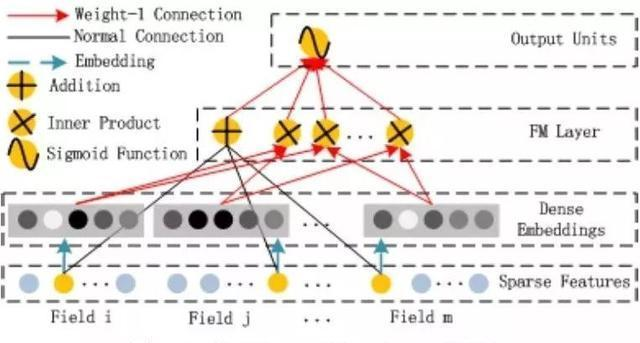

对于神经网络DNN部分，其模型如下所示

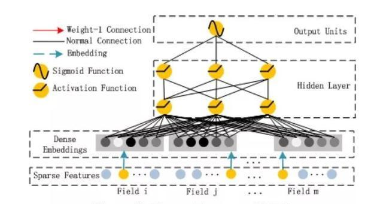

深度部分是一个前馈神经网络，可以学习高阶的特征组合。需要注意的是原始的输入的数据是很多个字段的高维稀疏数据。因此引入一个embedding layer将输入向量压缩到低维稠密向量。 
embedding layer的结构如下图所示，

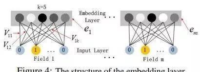

embedding layer有两个有趣的特性：

- 输入数据的每个字段的特征经过embedding之后，都为k维(lantent vector的维度),所以embedding后的特征维度是 字段数×k
- 在FM里得到的隐变量V现在作为了嵌入层网络的权重,FM模型作为整个模型的一部分与其他深度学习模型一起参与整体的学习, 实现端到端的训练。

## reference

[DeepFM 论文](https://arxiv.org/pdf/1703.04247.pdf)

[CTR预估算法之FM, FFM, DeepFM及实践](https://blog.csdn.net/John_xyz/article/details/78933253)

[推荐系统 - DeepFM架构详解(TODO)](https://blog.csdn.net/maqunfi/article/details/99635620)

[推荐系统遇上深度学习(三)--DeepFM模型理论和实践(TODO)](https://www.jianshu.com/p/6f1c2643d31b)

[利用源码对deepfm中的fm层 dnn层进行讲解（五）(TODO)](https://blog.csdn.net/a1066196847/article/details/101158787)

[推荐系统 - DeepFM架构详解(TODO)](https://blog.csdn.net/maqunfi/article/details/99635620)

[美团-深入FFM原理与实践](https://tech.meituan.com/2016/03/03/deep-understanding-of-ffm-principles-and-practices.html)

[推荐系统遇上深度学习(二)--FFM模型理论和实践](https://cloud.tencent.com/developer/article/1096536)

[FFM 论文](https://www.csie.ntu.edu.tw/~cjlin/papers/ffm.pdf)

[libffm](https://github.com/guestwalk/libffm)

# FFM

FFM 把相同性质的特征归于同一个filed。例如，广告分类为例，“Day=26/11/15”、“Day=1/7/14”、“Day=19/2/15”这三个特征都是代表日期的，可以放到同一个field中。同理，商品的末级品类编码生成了550个特征，这550个特征都是说明商品所属的品类，因此它们也可以放到同一个field中。简单来说，同一个categorical特征经过One-Hot编码生成的数值特征都可以放到同一个field，包括用户性别、职业、品类偏好等。

在FFM中，每一维特征 $x_i$，针对其它特征的每一种field $f_j$，都会学习一个隐向量 
$v_{i,f_j}$。因此，隐向量不仅与特征相关，也与field相关。也就是说，“Day=26/11/15”这个特征与“Country”特征和“Ad_type”特征进行关联的时候使用不同的隐向量，这与“Country”和“Ad_type”的内在差异相符，也是FFM中“field-aware”的由来。

## FFM理论

假设样本的n个特征属于 f 个field，那么FFM的二次项有 nf 个隐向量。而在FM模型中，每一维特征的隐向量只有一个，因此FM可以看作FFM的特例，是把所有特征都归于一个field时的FFM模型。根据FFM的field敏感特性，可以导出模型方程为：

$y(x) = w_0 + \sum_{i=1}^n w_i x_i + \sum_{i=1}^{n-1} \sum_{j=i+1}^n <v_{i,f_j}, v_{j,f_i}> x_i x_j$

其中， $f_j$是第j个特征的所属的filed。如果隐向量的长度为k，那么FFM的二次参数有 nfk个，远多于FM模型的nk个。
此外，由于隐向量与field相关，FFM二次项并不能够化简，其预测复杂度为 O(kn^2)

下面以一个例子简单说明FFM的特征组合方式[9]。输入记录如下

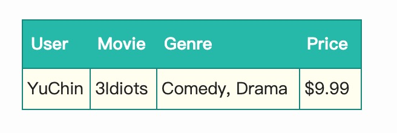

这条记录可以编码成5个特征，其中“Genre=Comedy”和“Genre=Drama”属于同一个field，“Price”是数值型，不用One-Hot编码转换。为了方便说明FFM的样本格式，我们将所有的特征和对应的field映射成整数编号。

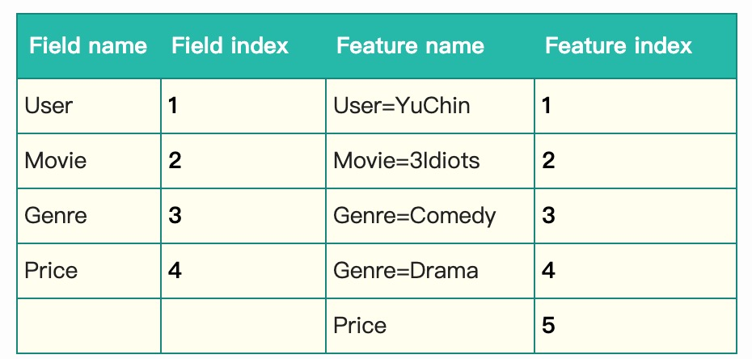

那么，FFM的组合特征有10项，如下图所示。

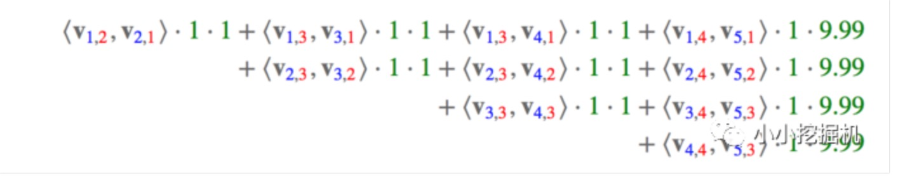

其中，红色是field编号，蓝色是特征编号，绿色是此样本的特征取值。二次项的系数是通过与特征field相关的隐向量点积得到的，二次项共有 $\frac {n(n−1)}{2}$ 个。

## FFM损失函数

这里讲得只是一种FFM的实现方式，并不是唯一的。FFM将问题定义为分类问题，使用的是logistic loss，同时加入了正则项

$min_w \sum_{i=1}^L log(1 + exp{-y_i \phi(w, x_i)}) + \lambda / 2 ||w||^2$

where $y_i \in {-1, 1}$

## FFM实战

https://github.com/princewen/tensorflow_practice/tree/master/recommendation-FFM-Demo

## FFM优缺点

- 优点： 细化隐向量的表示，同一特征针对不同的filed使用不同的隐向量，模型建模更加准确

- 缺点：计算复杂度比较高，参数个数为 nkf，计算复杂度为O(k * n^2)

## 使用FFM需要注意的地方

- 样本归一化。否则容易造成数据溢出，梯度计算失败
- 特征归一化。消除不同特征取值范围不同，量纲不同造成问题。
- FFM容易过拟合。因此可以采用dropout
- 省略零值特征。零值特征对模型没有任何贡献，不论是1次项还是2次项都为0

## reference

[CTR and NLP](https://blog.csdn.net/weixin_37947156/article/details/95638910)

# xDeepFM

## xDeepFM 的优势

- 传统交叉特征缺点

对于预测性系统来讲，特征工程起到非常重要的作用，其中挖掘交叉特征也是至关重要的。交叉特征是指两个或者多个原始特征之间的交叉组合。传统的推荐系统，挖掘交叉特征主要靠人工提取，主要有如下三个缺点

> 1. 重要的特征都与应用场景息息相关，针对于每个场景都要花费大量时间和精力了解数据的规律后才能设计和提取有效的高阶特征组合;
>
> 2. 原始数据中包含大量的稀疏特征，交叉的特征维度空间是原始特征维度的乘积，容易造成维度灾难
>
> 3. 人工提取特征无法泛化到未曾在训练样本中出现过的模式中

- 基于深度学习的交叉特征缺点

目前大部分研究工作都是基于因子分解机框架，利用多层全连接神经网络自动学习特征间的高阶交互关系，例如FNN、PNN、DeepFM等，其缺点是模型学习到的隐式的交叉特征，形式是未知的、不可控的; 另外是特征交互是发生在元素级(bit-wise)而不是特征向量之间(vector-wise)，这一点违背了因子分解机的初衷。

- xDeepFM 的优势

> 1. 能够同时以显式和隐式的方式自动学习到高阶交互特征。
>
> 2. 特征交互发生在向量级，同时兼具记忆和泛化的学习能力。

- bit-wise VS vector-wise

> 例如: 隐向量维度为3维, (a1,b1,c1) 和(a2,b2,c3)交互，那么元素集(bit-wise)为 f(w1*a1*a2, w2*b1*b2, w3*c1*c2); 而向量级(vector-wise) 为 f(w(a1*a2, b1*b2, c1*c2))。

- explicitly VS implicitly

> 显式的特征交互和隐式的特征交互。以两个特征为例xi和xj，在经过一系列变换后，我们可以表示成 wij * (xi * xj)的形式，就可以认为是显式特征交互，否则的话，是隐式的特征交互。

## xDeepFM模型

### Compressed Interaction Network(CIN)

计算公式: $X^k_{h,*} = \sum_{i=1}^{H_{k-1}} \sum_{j=1}^m W^{k,h}_{ij}(X^{k-1}_{i,*} \circ X^{0}_{j,*})$

隐层的计算可以分成两个步骤:（1）根据前一层隐层的状态$X_k$ 和原特征矩阵 $X_0$，计算出一个中间结果 $Z_{k+1}$，它是一个三维的张量，如下图所示：

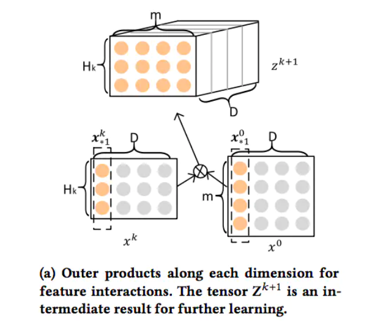

在这个中间结果上，我们用$H_{k+1}$ 个尺寸为 $m*H_k$ 的卷积核生成下一层隐层的状态，该过程如图2所示

## reference

[2018-xDeepFM: Combining Explicit and Implicit Feature Interactions for Recommender Systems](https://arxiv.org/pdf/1803.05170.pdf)

[xDeepFM模型](https://blog.csdn.net/u010772289/article/details/104147138)

[推荐系统遇上深度学习(二十二)--DeepFM升级版XDeepFM模型强势来袭！](https://www.jianshu.com/p/b4128bc79df0)
