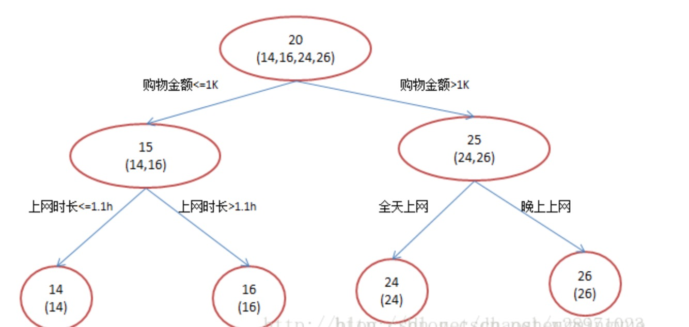
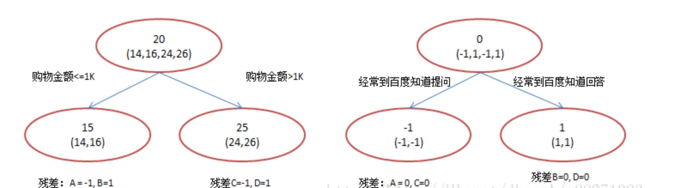

[TOC]

# CART 作为分类树

- CART作为分类树时，特征属性可以是连续类型也可以是离散类型，但类别标签必须是离散的。

- CART分类树在节点分裂时使用GINI指数，GINI指数是度量数据划分或训练数据集D的不纯度为主。

- 离散型特征处理

> 对于离散属性，可能会出现属性取值数N>=3的情况，因为CART是二叉树，此时需要考虑将N>=3个取值的离散特征的处理时也只能有两个分支，这就要通过组合人为的创建二取值序列并取GiniGain最小者作为树分叉决策点。
>
> 如某特征值具有[‘young’,’middle’,’old’]三个取值,那么二分序列会有如下3种可能性: [((‘young’,), (‘middle’, ‘old’)), ((‘middle’,), (‘young’, ‘old’)), ((‘old’,), (‘young’, ‘middle’))]。 采用CART算法，就需要分别计算按照上述List中的二分序列做分叉时的Gini指数，然后选取产生最小的GINIGain的二分序列做该特征的分叉二值序列参与树构建的递归。因此，CART不适用于离散特征有多个取值的场景。
>

- 连续特征处理

> 类似于C4.5，区别在于CART算法中要以GiniGain最小作为分界点选取标准。处理过程为：先把连续属性转换为离散属性再进行处理。虽然本质上属性的取值是连续的，但对于有限的采样数据它是离散的，如果有N条样本，那么我们有N-1种离散化的方法：<=vj的分到左子树，>vj的分到右子树。计算这N-1种情况下最大的信息增益率。
> 
> 另外，对于连续属性先进行排序（升序），只有在决策属性（即分类发生了变化）发生改变的地方才需要切开，这可以显著减少运算量。
>
>（1） 对特征的取值进行升序排序
>
>（2） 两个特征取值之间的中点作为可能的分裂点，将数据集分成两部分，计算每个可能的分裂点的GiniGain。优化算法就是只计算分类属性发生改变的那些特征取值
>
>（3）选择GiniGain最小的分裂点作为该特征的最佳分裂点（注意，若修正则此处需对最佳分裂点的Gini Gain减去log2(N-1)/|D|（N是连续特征的取值个数，D是训练数据数目）

- 注意

> 根据离散特征分支划分数据集时，子数据集中不再包含该特征（因为每个分支下的子数据集该特征的取值就会是一样的，信息增益或者Gini Gain将不再变化
>
> 而根据连续特征分支时，各分支下的子数据集必须依旧包含该特征（当然，左右分支各包含的分别是取值小于、大于等于分裂值的子数据集），因为该连续特征再接下来的树分支过程中可能依旧起着决定性作用。

# CART作为回归树

当数据拥有众多特征并且特征之间关系十分复杂时，构建全局模型的想法就显得太难了，也略显笨拙。而且，实际生活中很多问题都是非线性的，不可能使用全局线性模型来拟合任何数据。一种可行的方法是将数据集切分成很多份易建模的数据，然后利用线性回归技术来建模。如果首次切分后仍然难以拟合线性模型就继续切分。在这种切分方式下，树结构和回归法就相当有用。

> 回归树要求观察属性是连续类型，由于节点分裂选择特征属性时通常使用最小绝对偏差（LAD）或者最小二乘偏差（LSD）法，因此通常特征属性也是连续类型。以最小绝对偏差（LAD）为例
>
> (1)先令最佳方差为无限大bestVar=inf。
>
> (2)依次计算根据某特征（FeatureCount次迭代）划分数据后的总方差currentVar（，计算方法为：划分后左右子数据集的总方差之和），如果currentVar
>
> (3)返回最佳分支特征、分支特征值（离散特征则为二分序列、连续特征则为分裂点的值），左右分支子数据集。

# GBDT

- GBDT中的树都是回归树，不是分类树

> 决策树分为两大类，回归树和分类树。前者用于预测实数值，如明天的温度、用户的年龄、网页的相关程度；后者用于分类标签值，如晴天/阴天/雾/雨、用户性别、网页是否是垃圾页面。
>
> 这里要强调的是，前者的结果加减是有意义的，如10岁+5岁-3岁=12岁，后者则无意义，如男+男+女=到底是男是女？ GBDT的核心在于累加所有树的结果作为最终结果，就像前面对年龄的累加（-3是加负3），而分类树的结果显然是没办法累加的。

- GBDT 工作流程

> GBDT的核心就在于，每一棵树学的是之前所有树结论和的残差，这个残差就是一个加预测值后能得真实值的累加量。比如A的真实年龄是18岁，但第一棵树的预测年龄是12岁，差了6岁，即残差为6岁。那么在第二棵树里我们把A的年龄设为6岁去学习，如果第二棵树真的能把A分到6岁的叶子节点，那累加两棵树的结论就是A的真实年龄；如果第二棵树的结论是5岁，则A仍然存在1岁的残差，第三棵树里A的年龄就变成1岁，继续学。这就是Gradient Boosting在GBDT中的意义。
>
> 实例:
>
>还是年龄预测，简单起见训练集只有4个人，A,B,C,D，他们的年龄分别是14,16,24,26。其中A、B分别是高一和高三学生；C,D分别是应届毕业生和工作两年的员工。如果是用一棵传统的回归决策树来训练，会得到如下图1所示结果.

> 现在我们使用GBDT来做这件事，由于数据太少，我们限定叶子节点做多有两个，即每棵树都只有一个分枝，并且限定只学两棵树。我们会得到如下图2所示结果。

> 在第一棵树分枝和图1一样，由于A,B年龄较为相近，C,D年龄较为相近，他们被分为两拨，每拨用平均年龄作为预测值。此时计算残差（残差的意思就是： A的预测值 + A的残差 = A的实际值），所以A的残差就是16-15=1（注意，A的预测值是指前面所有树累加的和，这里前面只有一棵树所以直接是15，如果还有树则需要都累加起来作为A的预测值）。进而得到A,B,C,D的残差分别为-1,1，-1,1。然后我们拿残差替代A,B,C,D的原值，到第二棵树去学习，如果我们的预测值和它们的残差相等，则只需把第二棵树的结论累加到第一棵树上就能得到真实年龄了。这里的数据显然是我可以做的，第二棵树只有两个值1和-1，直接分成两个节点。此时所有人的残差都是0，即每个人都得到了真实的预测值。

> 问题:
>
> (1) 既然图1和图2 最终效果相同，为何还需要GBDT呢？答案是过拟合。过拟合是指为了让训练集精度更高，学到了很多”仅在训练集上成立的规律“，导致换一个数据集当前规律就不适用了。其实只要允许一棵树的叶子节点足够多，训练集总是能训练到100%准确率的（大不了最后一个叶子上只有一个instance)。在训练精度和实际精度（或测试精度）之间，后者才是我们想要真正得到的
>
> 这不是boosting吧？Adaboost可不是这么定义的。这是boosting，但不是Adaboost。GBDT不是Adaboost Decistion Tree。就像提到决策树大家会想起C4.5，提到boost多数人也会想到Adaboost。Adaboost是另一种boost方法，它按分类对错，分配不同的weight，计算cost function时使用这些weight，从而让“错分的样本权重越来越大，使它们更被重视”。Bootstrap也有类似思想，它在每一步迭代时不改变模型本身，也不计算残差，而是从N个instance训练集中按一定概率重新抽取N个instance出来（单个instance可以被重复sample），对着这N个新的instance再训练一轮。由于数据集变了迭代模型训练结果也不一样，而一个instance被前面分错的越厉害，它的概率就被设的越高，这样就能同样达到逐步关注被分错的instance，逐步完善的效果。Adaboost的方法被实践证明是一种很好的防止过拟合的方法，但至于为什么则至今没从理论上被证明。GBDT也可以在使用残差的同时引入Bootstrap re-sampling，GBDT多数实现版本中也增加的这个选项，但是否一定使用则有不同看法。re-sampling一个缺点是它的随机性，即同样的数据集合训练两遍结果是不一样的，也就是模型不可稳定复现，这对评估是很大挑战，比如很难说一个模型变好是因为你选用了更好的feature，还是由于这次sample的随机因素。

# reference

[CART分类与回归树与GBDT(Gradient Boost Decision Tree)](https://blog.csdn.net/chaoshengmingyue/article/details/76736068)
